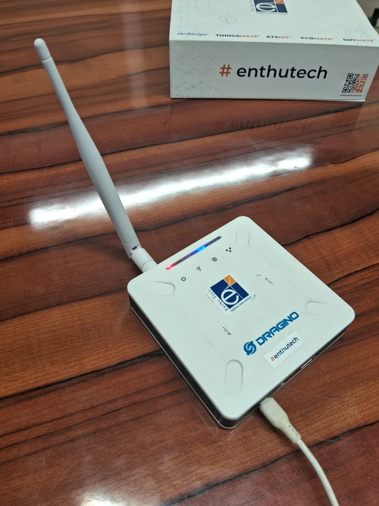
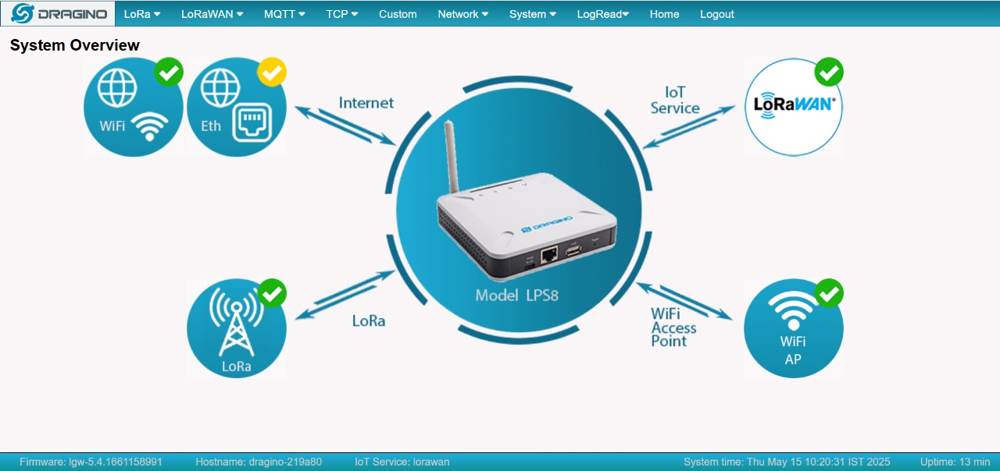

# EXPERIMENT-06-CONFIGURING-INDOOR-GATEWAY-FOR-LORAWAN
Date: 15.05.25

NAME: NIKSHITHA G

ROLL NO: 212223110031

DEPARTMENT: CSE(IOT)
## Aim: 

To  configure  Dragino LPS8 Indoor LoRaWAN gateway for things  network .

## Components required: 

Dragino LPS8 Indoor LoRaWAN gateway, ETHERNET cable RJ45,Internet connection 

## Theory :

Dragino LPS8 Indoor LoRaWAN gateway

 
The LPS8 is an open-source LoRaWAN Gateway. It lets you bridge LoRa wireless network to an IP network via WiFi, Ethernet. The LoRa wireless allows users to send data and reach extremely long ranges at low data rates. The LPS8 uses a Semtech packet forwarder and is fully compatible with the LoRaWAN protocol.

 
It includes an SX1308 LoRa concentrator, which provides 10 programmable parallel demodulation paths. LPS8 has pre-configured standard LoRaWAN frequency bands to use for different countries. Users can also customize the frequency bands to use in their own LoRa network.
The gateway has an antenna to receive the LoRa Packets in 8-channels. On the front side, it has a USB Type C port for Input Power of DC 5V,2A. Apart from the power, it also has an Ethernet port, USB Host Port & a Toggle button to reset the gateway.

 
At bottom of the gateway, it has the LoRa Pico Station information Like Model-LPS8, Frequency Band, Serial Number, and the WiFi mac address.
 
 LED Indicators
 

LPS8 has totally four LEDs, They are:
➢ Power LED: This RED LED will be solid if the device is properly powered.
➢ LoRa LED: This RGB LED will blink GREEN when the LoRaWAN module starts or transmit a
packet.
➢ SYS LED: This RGB LED will show different colors in the different states:
✓ SOLID BLUE: The device is alive with a LoRaWAN server connection.
✓ BLINKING BLUE: a) Device has internet connection but no LoRaWAN Connection. or b)
The device is in the booting stage, in this stage, it will BLINKING BLUE for several seconds and
then with SOLID RED and BLINKING BLUE together
✓ SOLID RED: The device doesn’t have an Internet connection.
➢ ETH LED: This LED shows the ETH interface connection status.
## Procedure :

The LPS8 is configured as a WiFi Access Point by factory default. You can access and configure the LPS8 after connecting to its WiFi network, or via its WAN Ethernet port.
1. Connect via WiFi

2. At the first boot of LPS8, it will auto-generate a WiFi network called dragino-xxxxxx with password: dragino+dragino
You can use a PC to connect to this WiFi network. The PC will get an IP address of 10.130.1.xxx and the LPS8 has the default IP 10.130.1.1.

3. Connect via Ethernet with DHCP IP from router
 
 

 
 Alternatively, connect the LPS8 Ethernet port to your router and LPS8 can obtain an IP address from your router. In the router’s management portal, you should be able to find what IP address the router has assigned to the LPS8. You can also use this IP to connect.
 
 4. Connect via WiFi with DHCP IP from router

5. Configuring Network Connection to Gateway
You can use any of the methods mentioned above to connect the Gateway to WiFi Network. The LPS8 is configured as a WiFi Access Point by factory default. So I followed the first method to connect to the network.

The Gateway will generate WiFi access point called dragino-xxxxxx with password: dragino+dragino. Connect to that Access point by entering the password.

6.After successful connection, open any of the Web Browser. Then browse to the following IP: 10.130.1.1. A web page like the below will appear.

Enter the User Name: root & Password: dragino. Then hit enter. A webpage like below will appear.

7.The login page will show internet connectivity status. If it is connected to the internet, it is wifi or ethernet. The webpage will also show the status of LoRaWAN connection, the LoRa connection, and the Access point connection.At this moment the Dragino LPS8 LoRaWAN Indoor Gateway doesn’t have an internet connection. So, first, we need to configure the LPS8 as a WiFi client by providing the Wifi credentials.

8.Go to the network, then click on WiFi.

9.The following Webpage will appear.

10. Click on the WiFi survey and select your WiFi Network. Then enter the WiFi password. Also “Enable WiFi client” option. Finally, you can click on save and apply.
    

11.Now you will get the following response as green. Congratulations, your Gateway is connected to the WiFi Network.

Now uncheck the above Enable WiFi access point option and click on the save and apply button. This will disable the Access Point. At this time you need to find the IP Address of your Gateway. You can get the IP Address from your WiFi Router Login page.

12. Configuring Gateway Frequency & Gateway IDNow, we need to setup the LoRa frequency. To do that go to the LoRa option as shown in the image below.
    

14. From the frequency option you need to select your LoRa frequency. Currently, I am using my LoRa devices from INDIA. So I choose  IN865 which is basically between  (865–867 MHz)
    
15. You can select the frequency band allowed in your region. There is also an option for GPS Enabling which you may enable or disable. Finally, click on save and apply.
The frequency band is allocated now. Now we need to get the Gateway ID. To get that go to the following option as LoRaWAN Semtech UDP.

16.Copy the Gateway ID as this will be required later. Then select the LoRaWAN Server as The Things Network . Select the server address  https://iot.saveetha.in

17.Click on save & apply. So finally the setting up of LPS8 Dragino LoRaWAN Gateway completes.

## OUTPUT 

## Result: 
The Dragino LPS8 Indoor LoRaWAN Gateway was successfully configured and connected.
